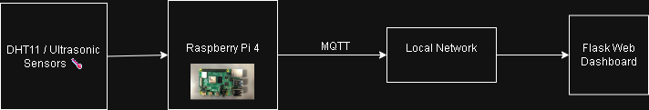

# GESS Inverter Monitoring Dashboard

## 📌 Overview
This project is a **Full-Stack Web Application** designed to monitor industrial power inverters in real-time, developed during my internship at **GESS / OES Ortadoğu Elektronik**.

It serves as a centralized control panel for operators, visualizing critical electrical parameters (Voltage, Load, Battery Health) and providing immediate visual alerts for system faults.



## ⚙️ Architecture
The system follows a Client-Server architecture:
* **Backend:** Python (Flask) acts as the API server, simulating sensor data streams (DC Bus, Grid Output, Battery Bank).
* **Frontend:** HTML5/JavaScript fetches data asynchronously every 2 seconds to update the UI without page reloads.
* **Visualization:** Chart.js renders dynamic, rolling-window graphs for trend analysis.

## 🛠️ Tech Stack
* **Backend:** Python, Flask (REST API).
* **Frontend:** HTML, CSS (Responsive Dashboard), JavaScript (Fetch API).
* **Data Viz:** Chart.js (Real-time plotting).
* **Hardware Target:** Designed for deployment on Raspberry Pi 4 (connected to Inverter UART).

## 🚀 Key Features
* **Real-time Polling:** Updates system status every 2 seconds via AJAX.
* **Fault Detection:** Visual alarm indicators for "Overload", "Battery Low", and "Over Temperature" states.
* **Trend Analysis:** Live graphing of Output Voltage stability and Load Percentage over time.
* **Responsive Design:** Optimized for tablet/desktop views in industrial environments.

## 🔧 How to Run Locally
1.  **Clone the repository:**
    ```bash
    git clone [https://github.com/armaghanimran123-create/iot-smart-home-monitor.git](https://github.com/armaghanimran123-create/iot-smart-home-monitor.git)
    cd iot-smart-home-monitor
    ```

2.  **Install Dependencies:**
    ```bash
    pip install -r requirements.txt
    ```

3.  **Start the Server:**
    ```bash
    python inverter_server.py
    ```

4.  **View Dashboard:**
    Open your browser and go to `http://127.0.0.1:5000/`.

> **Note:** The current version runs in "Simulation Mode," generating synthetic sensor data to demonstrate the UI capabilities without requiring physical connection to a GESS inverter.
