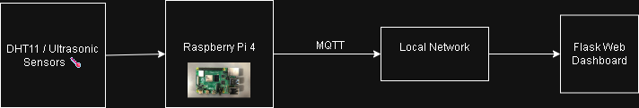

# GESS Inverter Monitoring Dashboard

A full-stack real-time monitoring dashboard for industrial power inverters, developed during an internship at **GESS / OES Ortadoğu Elektronik**. Visualizes critical electrical parameters and provides immediate fault alerts for operators.



## Overview

The system connects to an industrial inverter over UART serial and streams live readings (voltage, load, battery status) to a web dashboard that updates every 2 seconds without page reloads. A simulation mode runs automatically when no hardware is connected, making it fully testable on any machine.

## Architecture

Client-Server over HTTP:

- **Backend:** Python (Flask) serves the dashboard and exposes a REST API endpoint that reads inverter data over UART
- **Frontend:** HTML/JavaScript polls the API every 2 seconds via AJAX (Fetch API) and updates the UI in place
- **Visualization:** Chart.js renders rolling-window live graphs for voltage stability and load percentage trends
- **Hardware:** Designed for deployment on Raspberry Pi 4 connected to inverter UART (9600 baud, CSV format)

## Tech Stack

- **Backend:** Python, Flask
- **Frontend:** HTML, CSS, JavaScript (Fetch API)
- **Data Visualization:** Chart.js
- **Serial Communication:** pyserial
- **Hardware Target:** Raspberry Pi 4

## Features

- **Real-time polling:** Dashboard updates every 2 seconds via AJAX — no page reload
- **UART integration:** Reads live CSV data from inverter serial port (`/dev/ttyUSB0` on Linux, `COM3` on Windows)
- **Simulation mode:** Automatically activates when no hardware is connected — no code changes needed
- **Fault detection:** Visual alarm indicators for Overload, Battery Low, and Over Temperature states
- **Trend graphs:** Live rolling Chart.js plots for output voltage and load percentage
- **Graceful fallback:** If UART read fails mid-session, simulation kicks in for that frame rather than crashing

## UART Data Format

The server expects one CSV line per read from the inverter:

```
outputVoltage,inputVoltage,batteryVoltage,loadPercent,overload,batteryLow,overTemp
```

Example:
```
228,415,49,73,0,0,1
```

Fault flags are `1` (active) or `0` (normal). Adjust `UART_PORT` and `UART_BAUD` in `inverter_server.py` to match your hardware.

## How to Run

**Clone the repository:**
```bash
git clone https://github.com/armaghanimran123-create/iot-smart-home-monitor.git
cd iot-smart-home-monitor
```

**Install dependencies:**
```bash
pip install -r requirements.txt
```

**Start the server:**
```bash
python inverter_server.py
```

**View dashboard:** Open `http://127.0.0.1:5000/` in your browser.

The terminal will print either:
- `Connected to inverter on /dev/ttyUSB0` — real hardware mode
- `UART not available. Running in Simulation Mode.` — no hardware connected

## How to Deploy on Raspberry Pi

1. Connect inverter UART TX → RPi GPIO pin 15 (RX), GND → GND
2. Set `UART_PORT = '/dev/ttyAMA0'` in `inverter_server.py`
3. Run the server — it will automatically detect the hardware and switch out of simulation mode
